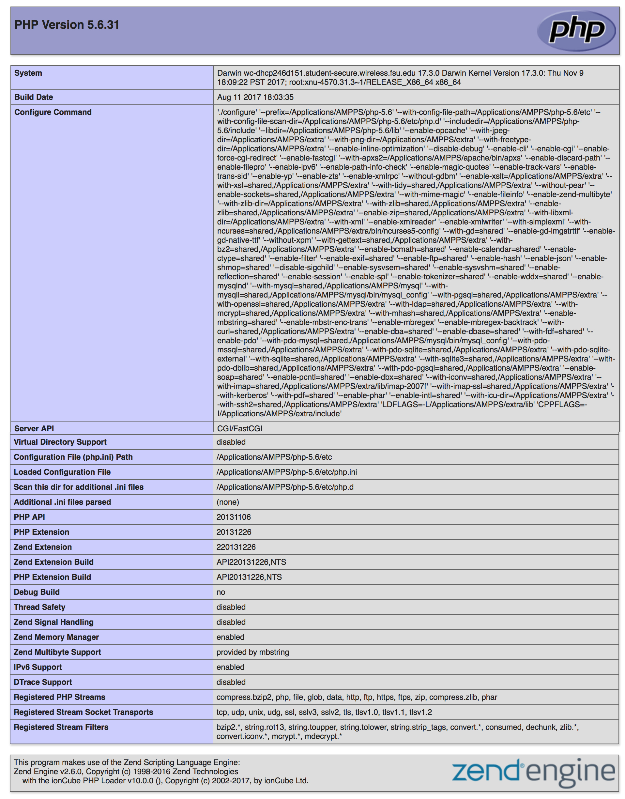
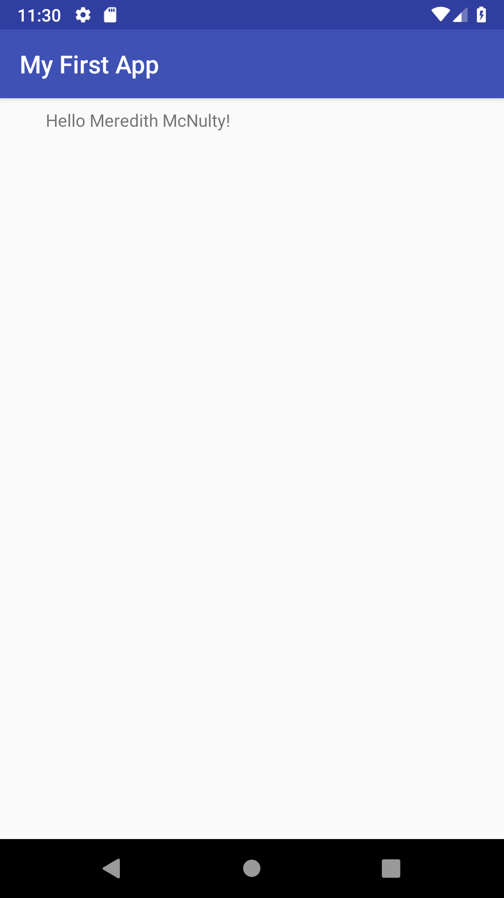

> **NOTE:** This README.md file should be placed at the **root of each of your repos directories.**
>
>Also, this file **must** use Markdown syntax, and provide project documentation as per below--otherwise, points **will** be deducted.
>

# LIS4381 - Mobile Web App Development

## Meredith McNulty

### Assignment #1 Requirements:

*Sub-Heading:*

1. Distributed Version Control with Git and Bitbucket
2. Development Installations
3. Chapter Questions 1 & 2

#### README.md file should include the following items:

* Screenshot of AMPPS Installation
* Screenshot of running java Hello
* Screenshot of running Android Studio - My First App
* git commands w/ short descriptions
* Bitbucket repo links: a) this assignment and b) the completed tutorials above

> This is a blockquote.
> 
> This is the second paragraph in the blockquote.
>
> #### Git commands w/short descriptions:

1. git init - create a new local repository
2. git status - List the files you've changed and those you still need to add or commit
3. git add - Add one or more files to staging (index)
4. git commit - Record changes to the repository
5. git push - Send changes to the master branch of your remote repository
6. git pull - Fetch and merge changes on the remote server to your working directory
7. git clone - create a working copy of a local repository

#### Assignment Screenshots:

*Screenshot of AMPPS running My PHP Installation*:

*Screenshot of running java Hello*:

*Screenshot of Android Studio - My First App*:

#### Tutorial Links:

*Bitbucket Tutorial - Station Locations:*
[A1 Bitbucket Station Locations Tutorial Link](https://bitbucket.org/meredithmcnulty/bitbucketstationlocations/ "Bitbucket Station Locations")
