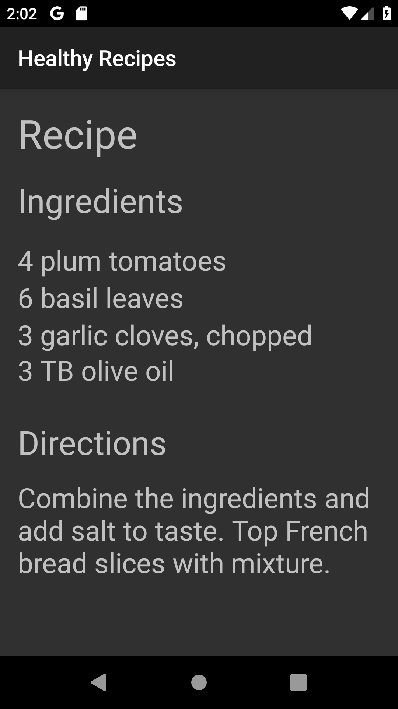

> **NOTE:** This README.md file should be placed at the **root of each of your repos directories.**
>
>Also, this file **must** use Markdown syntax, and provide project documentation as per below--otherwise, points **will** be deducted.
>

# LIS4381 - Mobile Web App Development

## Meredith McNulty

### Assignment #2 Requirements:

*Three Parts:*

1. Create a mobile recipe app using Android Studio.
2. Change the background color in both activities.
3. Chapter Questions 3 & 4.

#### README.md file should include the following items:

* Screenshot of running applications's first user interface
* Screenshot of running application's second user interface
* Bitbucket repo links: a) this assignment

#### Assignment Screenshots:

*Screenshot of running applications's first user interface*:

*Screenshot of running application's second user interface*:

