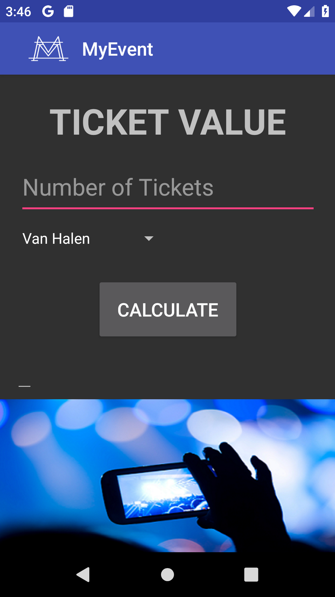

> **NOTE:** This README.md file should be placed at the **root of each of your repos directories.**
>
>Also, this file **must** use Markdown syntax, and provide project documentation as per below--otherwise, points **will** be deducted.
>

# LIS4381 - Mobile Web App Development

## Meredith McNulty

### Assignment #3 Requirements:

*Three Parts:*

1. Create a mobile recipe app using Android Studio.
2. Change the background color in both activities.
3. Chapter Questions 3 & 4.

Frequently, not only will you be asked to design and develop Web applications, but you will also be asked to create (design) database solutions that interact with the Web application—and, in fact, the data repository is the *core* of all Web applications. Hence, the following business requirements.

A pet store owner, who owns a number of pet stores, requests that you develop a Web application whereby he and his team can record, track, and maintain relevant company data, based upon the following business rules:
1. A customer can buy many pets, but each pet, if purchased, is purchased by only one customer.
2. A store has many pets, but each pet is sold by only one store.

*Remember:* an organization’s business rules are the key to a well-designed database.
For the Pet's R-Us business, it's important to ask the following questions to get a better idea of how the database and Web application should work together:

* Can a customer exist without a pet? Seems reasonable. Yes. (optional)
* Can a pet exist without a customer? Again, yes. (optional)
* Can a pet store not have any pets? It wouldn’t be a pet store. (mandatory)
* Can a pet exist without a pet store? Not in this design. (mandatory)

#### README.md file should include the following items:

* Screenshot of ERD
* Screenshot of running application's first user interface
* Screenshot of running application's second user interface
* Links to the following files: 
	a) a3.mwb
	b) a3.sql

#### Assignment Screenshots:

*Screenshot of running ERD*:

*Screenshot of running application's first user interface*:

*Screenshot of running application's second user interface*:

