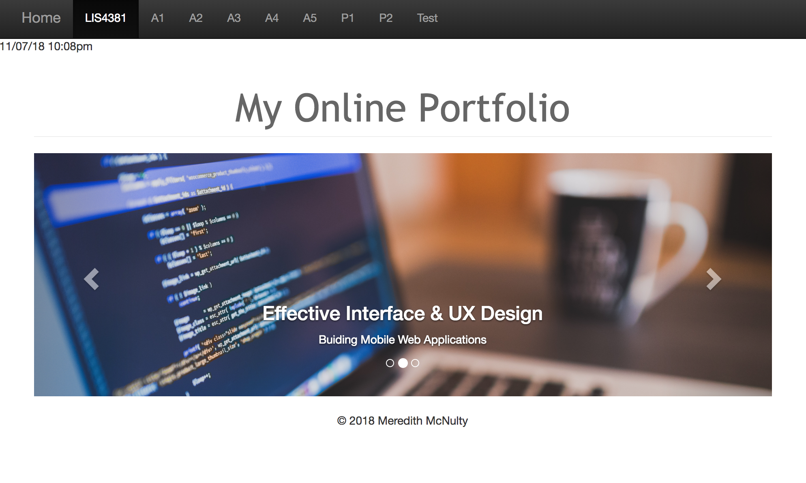
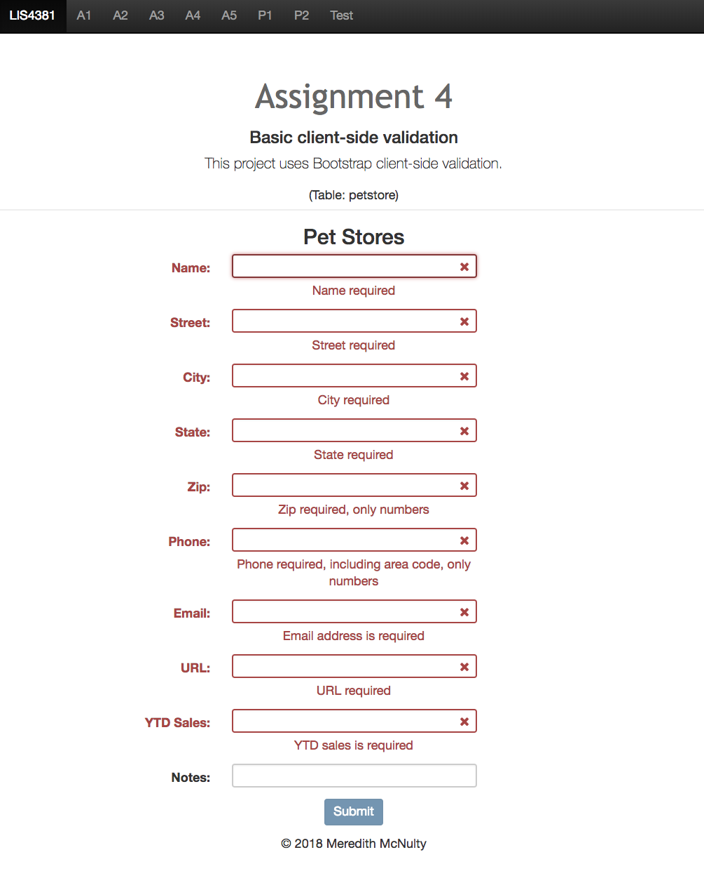
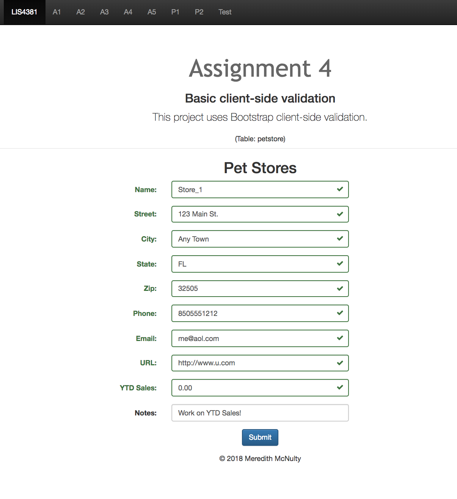

> **NOTE:** This README.md file should be placed at the **root of each of your repos directories.**
>
>Also, this file **must** use Markdown syntax, and provide project documentation as per below--otherwise, points **will** be deducted.
>

# LIS4381 - Mobile Web App Development

## Meredith McNulty

### Assignment #4 Requirements:

*Three Parts:*

1. Create an online portfolio web app
2. Make sure all links are functional
3. Provide screenshots of online portfolio

#### README.md file should include the following items:

* Screenshot of online portfolio main page
* Screenshot of failed validation
* Screenshot of passed validation
* Links to local lis4381 web app: 
	a) [Online Portfolio] (http://localhost/repos/lis4381/)

#### Assignment Screenshots:

*Screenshot of online portfolio main page*:

*Screenshot of failed validation*:

*Screenshot of passed validation*:

