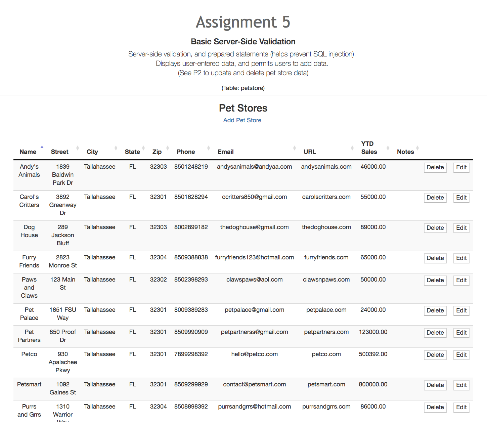
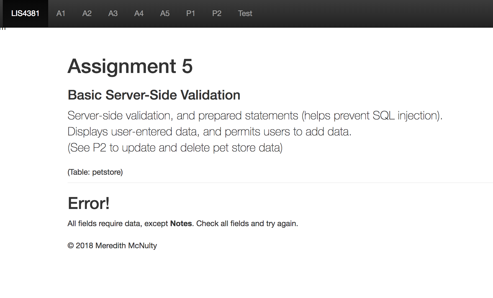

> **NOTE:** This README.md file should be placed at the **root of each of your repos directories.**
>
>Also, this file **must** use Markdown syntax, and provide project documentation as per below--otherwise, points **will** be deducted.
>

# LIS4381 - Mobile Web App Development

## Meredith McNulty

### Assignment #5 Requirements:

*Three Parts:*

1. Add server-side validation and regular expressions as per the database entity attribute requirements
2. Review other sub-directories and files, and modify them accordingly
3. Provide screenshots of index.php and add_petstore_process.php

#### README.md file should include the following items:

* Screenshots of index.php
* Screenshots of add_petstore_process.php (that includes error.php)
* Links to local lis4381 web app: 
	a) [Online Portfolio](http://localhost/repos/lis4381/)

#### Assignment Screenshots:

*Screenshot of index.php*:

*Screenshot of add_petstore_process.php*:

